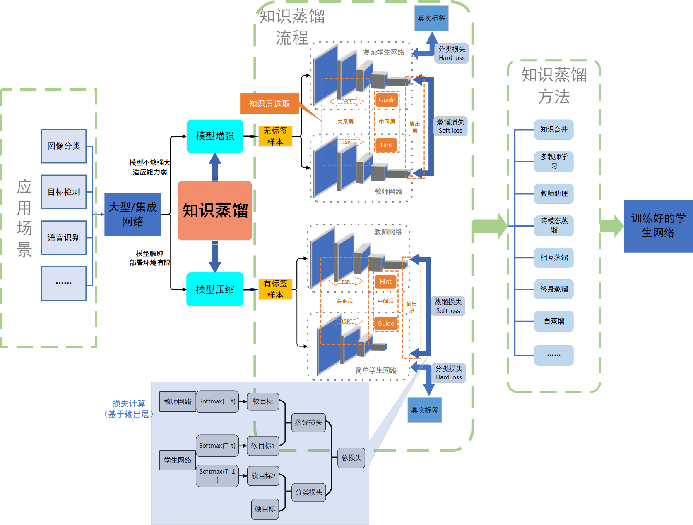
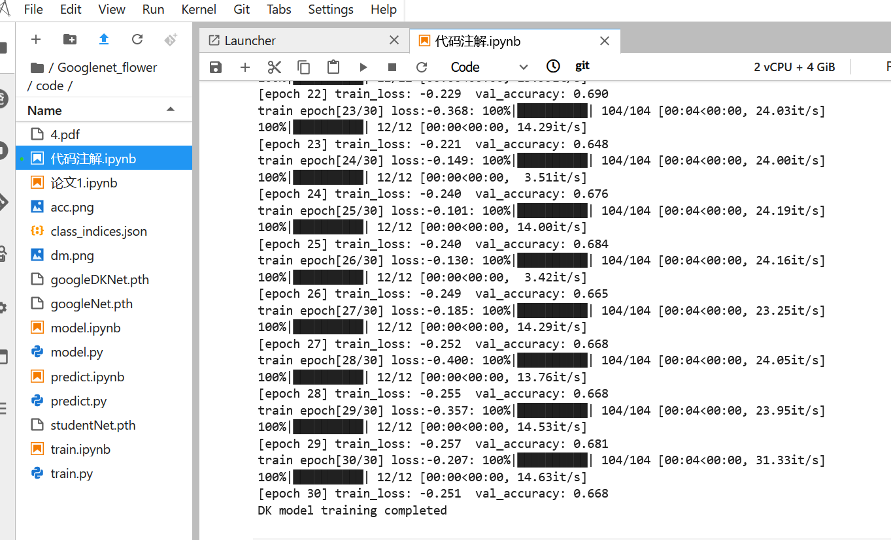
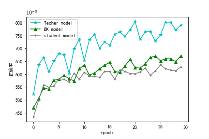

# 课设项目：基于GoogLeNet的知识蒸馏实验
## 题目介绍
在深度学习的背景下，为了达到更好的预测效果，高性能的神经网络往往层数纵深，参数密集，难以部署在资源受限的设备上。知识蒸馏作为一种模型压缩方法，可以将复杂网络(称为教师网络)学到的知识传递给小网络(称为学生网络)，使学生网络达到较好的预测效果，同时学生网络所占计算参数数量及内存大小远小于教师网络，从而使其移植到低内存低算力的终端上成为了可能。本项目介绍了知识蒸馏的理论知识和作用机制，并基于flower数据集利用知识蒸馏方法将GoogLeNet（教师网络，大小为50MB） 进行压缩，“知识” 选择教师网络的输出层，实验结果表明，蒸馏后的学生网络预测准确性要比单独训练的小模型高，且其模型大小不足100KB，模型压缩效果显著。
## 知识蒸馏思维导图

## 课设报告论文
知识蒸馏理论推导参见课设报告、小组信息及课设报告[点击此处下载](https://pan.baidu.com/s/1npay0u4kcOk1Y9ctPYjBUA) 
密码：学校英文简称
## 代码运行方法
* 1.先将flower数据集下载解压到data_set/flower_data文件夹下，具体方法见data_set的README文件
* 2.执行split_data.py
* 3.其余代码均在code文件夹内，train是训练代码，分别对教师网络、蒸馏网络、学生网络进行训练
* 4.训练好模型后，可用predict进行预测，预测使用图像是code同一目录下的test.jpg图片，可将其删除，使用自己的图片，注意名称格式不能变
* 5.另外提供visual文件对知识蒸馏温度T和训练过程进行可视化
## 运行结果截图

每轮epoch预测正确率：

